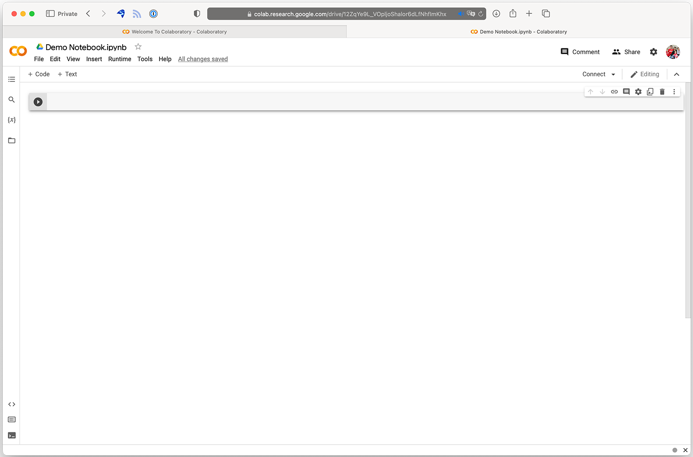
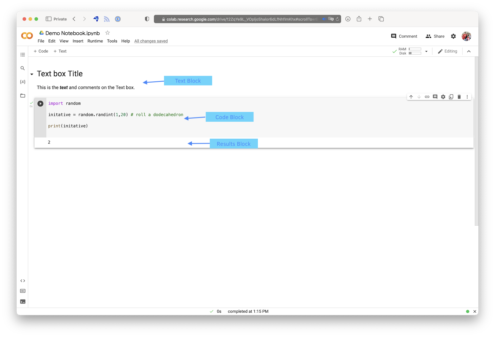

# Data Science Libraries

## Class Purpose

One of Python's secret powers is as a data science language.  Python and R regularly compete with each other as the most popular language for data science.  R is a more mature special focused language that is focused on statistics and numerical processing.  Python on the other hand is a general purpose language that is more widely used and is more recent to the data science game.  This is manifest in the different groups of people and types of problems that each language addresses.  In general Python advocates come from a computer science background and the tools and techniques are more focused on scripting repeatable solutions to problems.  R on the other hand attracts a audience from the statistical community and is more specialized in regression and other statistic techniques for learning about the process.  Neither language is better or worse than the other, they are just different.  

In order to adapt Python to be a language for data science a number of modules have been developed that make the process of reading in data, cleaning data, and presenting the results easier.  In addition, some tools have been built on top of Python to make interactive programming more accessible.  In this class we will begin learning about these modules and tools.  

## Class Outline

1. iPython Notebooks 
2. Numpy (NUMerical PYthon)
3. PANDAS (Python Data Analysis Library)
4. MatplotLib (Mathematical Plotting Library)
	
## Class Notes

### iPython Notebooks

Data science and analytics is a unique programming challenge.  With most programming projects, the goal is to write a piece of software once and then run in many times on different distributed computers.  Because of this, the tools have been focused on catching and correcting errors quickly and early in the development process.  The programs are also often large and the code is spread across many different files that different individuals may work on.  Because of this the tools often emphasize file management, distributed systems like GitHub, build processes to gather the code from different systems and assemble the software project, and automatic testing and validation. 

Data science on the other hand is generally about writing a piece of code many times and then running it only once to generate an output that can bundled into a report.  Because of this difference, the tools that are used to write regular software are often not well suited to data science.  Rather than tools for collaborative coding and building software, documentation and interactive programming become much more important.  It is no longer necessary to have handle all the edge cases in code because the program does not need to handle generic data, but rather specific data.  

To address some of these differences, the Python community developed a programming environment on top of the basic Python system called a *Notebook*.  It allows an analyst to write and run code interactively and accommodates extensive documentation, displaying of results, easy report building.  The end result is that a Notebook could potentially serve as a written report on the analysis with self updating tables and charts.  While most analyst don't go this far, most all analyst primarily use  a Notebook for the data science programming.

There are a couple of really good options for creating notebooks.  Notebook support is built into Visual Studio Code.  To create a Notebook simply select File>New File...>Jupyter Notebook (.ipynb support).  Alternatively you can just create a new file and save it with a .ipynb extension.  

The second great option is called [Google Colab](https://colab.research.google.com).  This is the Python Notebook version of Google Docs.  It is completely online and allows for collaborative editing, sharing, and integrates with Google Drive to store data and output.  Over the past couple of years, Google has created a huge library of help files, tutorials, and examples to support Colab and Python Notebooks.  Almost all the documentation about Colab also applies to local Python Notebooks. 

Notebook are divided into sections called blocks.  There are three types of blocks.  There first is a Text block.  With a text block you can type formatted text using a syntax called Markdown.  Markdown is just regular text with a few special options for formatting that text.  It was designed to be easily readable in plain text, but easily processed into nice looking HTML.  There are a number of great resources to learn Markdown.  In colab there is a nifty ribbon that will allow you to format your code using a wysiwyg style editor.  It is worth learning the commands however as it is much faster to just be able to type them out.  (This entire website is actually written in markdown.)  When "run" a text box will be rendered as formatted text.  To edit a text block you can simply double clock the text to switch to edit mode.

The second type of block is a code block.  In this block you can write Python code which will run  when the run button is pressed on the left.  (Short cut is Command/Control + Enter)
A Python notebook will keep all previously executed code blocks in memory so you can refer to a variable created in a previous block.  One weird thing is that you will need to run run previous blocks when you open up the file.  Code blocks do not run automatically and must be explicitly executed.

The third type of code block is a result.  You can't edit a result block.  It is created in response to a code block.  It will contain either the output of the code or an error message.  The output can be text, a table with data, or a chart or graph.

This is all you need to know to start being product in a Python Notebook.  Next steps to become more efficient would be starting to learn the keyboard shortcuts and markdown.

### Numpy

Numpy establishes the foundational data structures for working with data in Python.  You will not use it directly that often, but it is necessary to be familiar with it so that you can use higher level modules and packages. 

The notes for this section are contained in a Google Colab Notebook at [Numpy Class Notes](https://colab.research.google.com/drive/1ed3egZUFm0tAKbWa3p_Lz0vufXxo9OAN?usp=sharing).

If you would like to edit the document you should save a copy to your local Drive.  (File>Save Copy in Drive)

### Pandas

This is the primary data science package for working with datasets in Python.  The notes for this section are contained in a Google Colab Notebook, [Pandas Class Notes](
https://colab.research.google.com/drive/1n_t0jjEJW3oKHiTHyUAVko552HTY4sV7?usp=sharing)

As are reminder if you want to edit the file and type along you will need to save a copy of the notebook.

### Matplotlib

This is the most popular package for creating plots in Python.  The plots are not the most attractive so newer plotting libraries built upon MatplotLib have recently become more popular. The most widely used of these is Seaborn.  We don't have time to cover it in class, but you should have all the skills necessary to learn it yourself at this point.

The notes for this section are contained in a Google Colab Notebook at [MatplotLib Class Notes](https://colab.research.google.com/drive/1ueKMg-8KHyk_egeua_465Mh_Vp5WWU0d?usp=sharing)

Remember to save a copy of the notebook.

### Assignment

You can download the assignment from either LearningSuite or [Here](./PandasAssignment.zip).

You will duplicating the analysis for a article on [FiveThirtyEight](https://projects.fivethirtyeight.com/college-fight-song-lyrics/) from a few years ago regarding college fight songs.  

The assignment is in a Python Notebook.  To submit the assignment you will need to provide the .ipynb file.  This can be uploaded and downloaded from Google Colab using the file menu or edited directly in Visual Studio Code.   