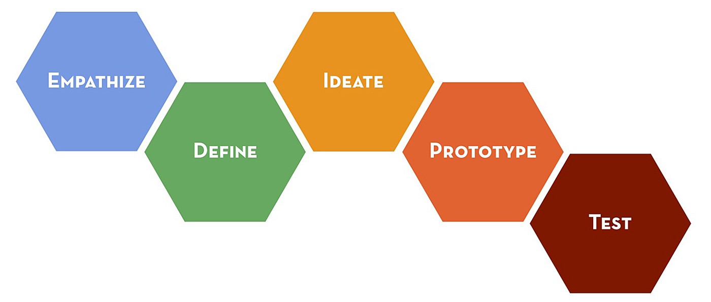

# The UX Design Process

## Class Purpose

Develop an understanding and apply the principles of the design thinking process as it relates to UX design.  This is one of the fundamental aspects of a product managers job.  Sometimes a PM will have a team member that is a UX expert or hire an outside consultant, but the UX design process is an important aspect of their job and it is valuable to have a basic understandingof the process. 

## Class Outline

1. An Introduction to User Experience Design
2. The design thinking process
3. User research and developing empathy
4. Defining the problem
5. Ideate to develop multiple potential solutions
6. Prototype the most promising ideas
7. Test and refine the prototypes
8. Wrap up and iterate on the process
   
	
## Class Notes

Much of this material was pulled from [CareerFoundry](https://careerfoundry.com/en/tutorials/ux-design-process-for-beginners/introduction-to-ux-design/)

## An Introduction to User Experience Design

What is UX Design? - "The process of designing great digital product experiences that work well for the people who use those products."

To summarize a UX Designer:

- Works to understand people and the problems they face related to the digital experience 
- Can identify and describe the pain points, frictions, a problems that a user experiences
- Design or redesign a product to reduce the friction and help users accomplish the task
- Design in ways that are compatible with business objectives and constraints
- Test and iterate on different design ideas to continuously improve the product or adapt to changing user and business requirements

The User Experiences designer accomplishes this by:

- Conducting, analyzing, and summarizing user research
- Meeting with stake holders to understand there priorities and constraints
- Lead workshops to create materials that will cultivate empathy toward the user and communicate insights about the customers journey
- Build wireframes and prototypes that reflect the insights and needs of users while aligning with business goals
- Test prototypes to understand how users work with their products to refine and polish the design of the products.
- Work with UI designers and developers to implement the designs consistent with their vision of the product.

One way UX designers can accomplish much of their work by following the design thinking approach.  The design thinking approach is an iterative framework that outlines specific steps to crafting user centered designs.  The process is iterative and may be non-linear as you bounce between different steps in the process or revisit earlier steps and situations and changing understanding dictate.

Steps steps in the Design Thinking process are:

> ### Wicked vs. Kind Problems  
> Wicked problems are problems that are complicated and varied without are real set of either rulers or well-defined outcomes.  Wicked problems do not have a clear set of inputs, lack immediate feedback, and don't have a clearly defined outcome.  In many cases a solution is judges on the "I know it when I see it!" criteria.  This is opposed to kind problems where the parameters and factors that influence a decision are clearly understood and well defined, feedback is immediate, and the rules and steps to improve are immediately clear. This does not mean that kind problems are simple or easily solved. A common example of a kind problem is the game of chess.  In chess there are approximately 10^40 positions created by legal moves and the problem is one of finding the best possible move for any given position.  This is not a simple problem, but if is still considered a nice problem since the rules and desired outcome are clear.  
> Wicked problems are the domain of design thinking.  The goal of the procedure is not necessarily to come up with the optimal solution, but rather to devise and acceptable solution that will accomplish broader goals.

The Design Thinking Process formalizes a method for arriving and reasonable solutions to wicked problems.  Inside each step of the design thinking process are a number of recommendations on how to accomplish the specific step and it is the job of the designer to synthesize this information to create a good solution to a specific problem.

## Step 1 - Empathize

The fist step in the design thinking process is developing empathy for the user.  The word empathize is specifically chosen to highlight that this step is about more than just understanding the user.  In the design process you will be making many decisions on behalf of the user without being able to consult with the user at each step.  In order to make those decisions accurately you will need to not only understand what the user needs and wants, but you will need to under stand their motivations, background, habits, frustrations, environment, and goals.  

From a practical perspective, empathizing with he the user takes the form of engaging in user research.  This can take many forms from qualitative to quantitative research, ethnographic studies to mass market surveys.  The end goal is the same to have a good representation of the person that is going to user your product.  The only requirement is that the research should reflect each individuals humanity.

 In most organizations and for most products qualitative research is more common than quantitative research especially at the beginning of the design process.
 
 Some types of user research:
 
_Qualitative research methods_
- User Interview (By far the most common)
- Focus groups
- Shadow sessions
- Diary studies

_Quantitative research methods_
- App Analytics
- User surveys
- Mouse heatmaps
- Funnel analysis
- Cohort analysis
- A/B testing

The output of the empathize step is is usually a summary of the research presented in a way that can be regularly referred to during the design process.  The main goal is to have a set of materials that can be easily referred to during the design process in order to humanize users and inform design decisions.  This are commonly referred to as *deliverables*.

These deliverables will help you:
- Access your research quickly and regularly
- Summarize your research so others can quickly and easily understand your findings
- Cultivate empathy among stakeholders, designers, and developers by humanizing users and describing the problems and pain points they face.

There are two common formats for _deliverables_ although many different formats could be used.

#### User Personas

A user persona is a concise research based sketch of a user.  It is generally an archetype or a caricature of a typical consumer in a specific segment.  They provide a concise description of a specific type of person in a way that makes the person feel alive and real.  Because we are genetically programmed to connect with humans it is often easier for a person connect and empathize with a user persona rather than a list of relevant facts and figures.  Because of this it can help keep the user at the forefront when making design decisions.

A couple of important things to keep in mind.  Personas are powerful tools for humanizing users, but they can be easily misused.  One of the main problems is failing to remember that the user persona is simply a caricature of an actual user.  They are meant to convey information quickly, but they don't actually represent a real person and actual users will be more varied than the persona dictates.  

The second problem that I have seen with personas is that people will often fill in the blanks about the people when features are not explicitly defined.  They are especially likely to do this when the persona resembles themselves or somebody they are close too.  This leads to designers injecting too much of their own preferences, opinions, and biases into the design process at the expense of accurately representing the user.  This is especially a problem as designers are not representative of the general population of users due to a selection effect.

To avoid some of these problems it it is usually a good idea to create multiple personas for and given project.  Using multiple persona allows you to reflect the real diversity that is present in your user base.  You should also be intentional about having your personas reflect a diverse background of gender, race, age, culture, etc.  

#### User Journey Maps

User Journey maps are a visual description of how users move through the journey of using the product or a part of the product.  They will capture important motivation and goals, steps that need to be completed, and identify the customers desired outcomes.  One thing to keep in mind about user journey maps is that they should begin with motivations that happen before a user interacts with the map and end after the app is closed.  This keeps the focus of the design on the user rather than simply on the app itself and opens you up to consider a wider variety of solutions to the problems that the user faces.

The main use of a customer journey map for UX designers is to understand the role the product places in a customers life and experiences.  It will provide context and background that will help the designer empathize with the customer and identify pain points, road blocks, and opportunities.

Because of the type of information a customer journey map usually contains, they are generally not used before a company has actual customers. However once a customer journey map is feasible it can be useful for many different activities in a firm including helping the CEO and executive team understand and focus on the customer, assisting marketing in understanding how to better manage the customer experience, or training front line works. 

For more details on how to create a map check out [7 Simple Steps to Build a Customer JOurney Map](https://careerfoundry.com/en/blog/ux-design/how-to-make-customer-journey-map-with-template/)

### Exercise - Create a user persona

Using the template from CareerFoundry [Download Template](https://images.careerfoundry.com/public/resources/persona_template_ux_design_careerfoundry.pdf) create a Customer Persona for our Career Search app.  

1. As a class decide on how many user personas we should create.  (Remember having more than one persona is a good idea.)
2. As a class discuss different customer segments that we would like to target.
3. Divide up in to groups of 3-4
4. Assign each group a specific target and decide on general demographics for those targets.  Doing this together will ensure that our user personas properly reflect the diversity of our target market.
5. Get together with your group and finish fleshing out the user persona.  This should take about 30-45 minutes if you work quickly.

## Step 2 - Define

The goal of the define step is to articulate the user's problem that we are intending to solve with the product we are designing.  This is very similar to defining the problem that you talked about heavily in analytics.  With wicked problems you may need to make multiple cracks at this and don't be afraid to redefine the problem multiple times as you move through the design process, receive feedback from users, and iterate on potential design solutions.  

There are a number of different techniques that we can use to define the problem. One of the most common in design circles is to define the problem as a *"How Might We..." (HMW)* question.  This is usually phrased as "How might we ..."  For example if you are interested in designing an app to help parents find educational and fun activities to do with their children you might define the problems as: "How might we assist parents on  finding a fun and educational activity to do with their young children?"  In keeping with step one, empathize, HWM questions should be customer centered and reflect customer problems rather than business constraints. 

It would also be perfectly reasonable to apply the TOSCA framework from [Cracked It: How to solve big problems and sell solutions like top strategy consultants](https://www.amazon.com/Cracked-problems-solutions-strategy-consultants/dp/3319893742/ref=tmm_hrd_swatch_0?_encoding=UTF8&qid=1666215115&sr=8-2-spons).

TOSCA stands for:
- *T* - Troubles: What are the symptoms or troubles that motivated the search for a solution?
- *O* - Owner: Who is the owner of the problem? This is the person that will evaluate the solution.
- *S* - Success Criteria - How will we know that the problem is solve?  This often takes includes a time frame and will answer a question such as "Imagine it is one year from today and we are meeting again. What would the situation be like and how would be know it is time to celebrate?"
- *C* - Constraints - What are the factors that will influence the ways that the problem can be solved.  These could be things like time or monetary budgets, business goals, legal or ethical requirements, etc.
- *A* - Actors - Who are the individuals and stakeholders that are impacted by or can impact the problem.

With wicked problems, creating a problem statement is often very difficult.  The problems are often poorly understood and difficult to articulate.  The good thing is that it is not as important to have a perfect problem statement in the design thinking approach.  You will revisit your problem statement multiple times as you iterate on the design and learn more about the user, their needs, wants, and preferences.

## Step 3 - Ideate

The main objective of this step is to generate a large and diverse set of potential solutions to the problem as defined.  In the ideate phase we are shooting for quantity over quality.  At the end of the phase we will start filtering ideas to select 1-2 of our best ideas, but you should be careful to to censor or filter ideas too soon.

One of the core principles in the ideate phase is that we want to take to time to carefully examine our assumptions and intuition.  Many times the ideate phase will help you think more clearly about the research problem and solution that you have identified.  

When you are ideating you need to make sure that you separate out the process of generating ideas from filtering ideas.  If you are constantly evaluating a design to try to decide if it is a good or bad idea you will artificially censor your self and generate fewer ideas overall.  

You are familiar with many of the methods used to ideate.  The best method is going to be highly context dependent.  I often find it helpful to create a little space between defining the problem and generating ideas.  I often define problems with a notion of what the solution will be when writing the problem definition down.  This creates some bias towards the first idea being generated as being the right one.

Some methods of generating ideas:

- Brainstorming: This is exactly what you would think.  You simply list the ideas on a shared whiteboard or other workspace with everybody throwing out ideas as they occur.
- Bodystorming: This is brainstorming with a twist.  Instead of sitting around a conference table, you recreate the environment and context where the problem occurs.
- Brainwriting: This is a journaling or free writing exercise.  Similar to brainstorming, but is an individual exercise where ideas are generated individually and then shared.  It avoids some of the group think problems with brainstorming.
- Brainwalking: This is Brainwriting only you incorporate movement by placing sheets of paper strategically around the room and have individuals move from station to station, read the paper and then add ideas.  
- Mindmapping: Used during or after a brainstorming session to create a visualize the connections between different ideas.
- SCAMPER: An acronym for Substitute, Adapt, Combine, Modify, Put to other users, Eliminate, Rearrange or reverse.  This is a common industry practice when you have an existing product that you are trying to refine and improve.
- Crazy Eights: This is a sketching exercise where you rapidly sketch out eight different products.  This is most usually if the design is going to be visual like the UI of a product.  

A couple of things to keep in mind.  When ideating in a group there is a strong social bias that can interfere with the process.  The first is called social desirability bias.  People may filter thought because they are afraid of how they will be perceived by the group.  This leads to fewer ideas overall and a great idea could be missed.  The second problem is groupthink.  As social creatures humans have a tendency to change their thinking to reflect what they perceive as the dominate position of the group they are a part of.  This can greatly limit the range of ideas that can be created.  The final problem is one of participation.  In any group setting there are dominate and less dominate participants.  Group brainstorming sessions are classic cases where less dominate individuals are underrepresented.  It takes special skill to make sure that they are heard from and represented.  

One way to avoid many of these problems is to combine individual exercises with group discussion.  By starting with an individual exercise, you make sure that everybody participates without influencing each other's opinions too much.  You can then start a group brainstorming session with a foundation and a set of ideas that you can riff on.

### Exercise - Crazy 8's 

1. Select a screen from our app.  (I would recommend that you select a reporting screen since there will be many of those.)
2. Fold 1 or 2 sheets of paper into quarters.  (You will create 8 sketches total.  With one sheet of paper you will use both sides.)
3. Review your problem statement 
4. Set the time for 1-3 minutes.  In that time sketch out one idea for how that screen of your app would look.  It should be messy.  You are going to be sketching very quickly.
5. Reset and then repeat step 4 7 more times.  You should end up with 8 total sketches.  Most of them will be bad, but hopefully there are 1-2 good ideas in the mess.
6. Take a few minutes to review your ideas and select your best one or 2 to present to the class.  

The final step in the ideate process is filtering your ideas.  This is where you need to start getting critical.  Does the idea meet the objective as established in the define step?  Can it be reasonably implemented in the time and budget allocated?  Does it create additional issues or questions?  Will it delight the user?

Once you have a top 1-2 ideas we can move on the the next step...prototype.

